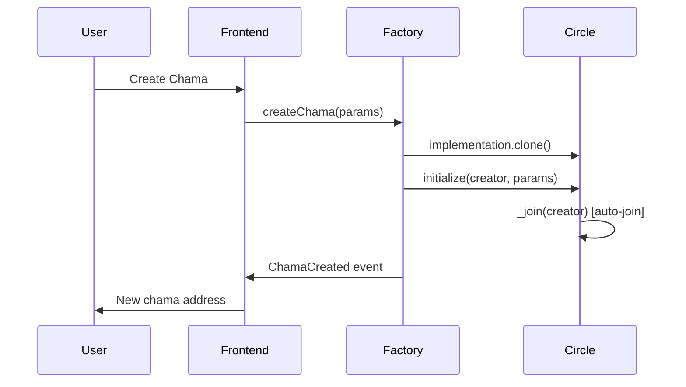
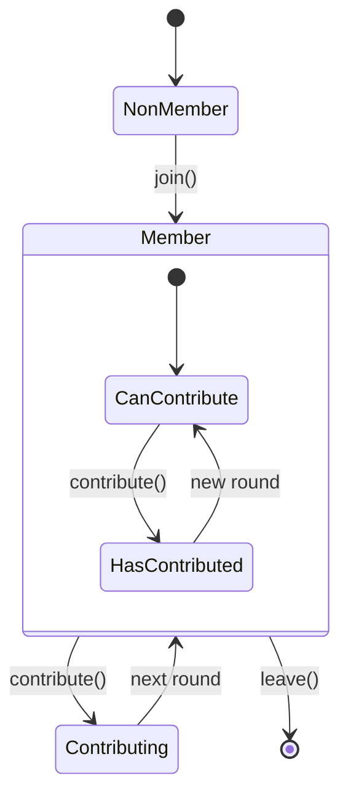

# Factory and Circle Contract Architecture Review

## 🏗️ **Contract Architecture Overview**

### **Factory Pattern Implementation**
The system uses the **Factory + Clone Pattern** for efficient chama deployment:

```
ChamaFactory (Singleton)
    ├── implementation: ChamaCircle (Master Template)
    ├── createChama() → Clone + Initialize
    └── ChamaCreated Event

ChamaCircle Clones (Multiple Instances)
    ├── initialize() (called by Factory)
    ├── join(), contribute(), leave()
    └── Individual chama state
```

---

## 🔄 **Contract Interaction Flow**

### **1. Chama Creation Process**



**Factory.sol - createChama():**
```solidity
function createChama(
    IERC20  token,
    uint256 contribution,
    uint256 securityDeposit,
    uint256 roundDuration,
    uint256 lateWindow,
    uint256 latePenalty,
    uint256 memberTarget
) external payable returns (address chama) {
    // 1. Clone the implementation
    chama = implementation.clone();
    
    // 2. Initialize the clone
    ChamaCircle(payable(chama)).initialize{value: msg.value}(
        msg.sender, token, contribution, securityDeposit,
        roundDuration, lateWindow, latePenalty, memberTarget
    );
    
    // 3. Emit event for indexing
    emit ChamaCreated(++chamaCounter, msg.sender, chama, ...);
}
```

**Circle.sol - initialize():**
```solidity
function initialize(address creator, ...) external payable {
    require(factory == address(0), "Already init");
    factory = msg.sender; // Set factory address
    
    // Set chama parameters
    token = _token;
    contribution = _contribution;
    // ... other params
    
    // Creator auto-joins
    _join(creator, msg.value);
    roundDeadline = block.timestamp + roundDuration;
    emit RoundStarted(1, roundDeadline);
}
```

### **2. Member Lifecycle**



---

## 🎯 **Key Design Patterns**

### **1. Factory Pattern Benefits**
- ✅ **Gas Efficiency**: Clones cost ~2,000 gas vs full deployment
- ✅ **Consistent Interface**: All chamas have same ABI
- ✅ **Upgradeable**: Can deploy new implementation versions
- ✅ **Event Indexing**: Centralized chama discovery

### **2. Initialization Pattern**
- ✅ **One-time Setup**: `initialize()` replaces constructor
- ✅ **Creator Auto-join**: Founder becomes first member
- ✅ **Immutable After Init**: Cannot be re-initialized

### **3. State Separation**
```
Factory State (Global):
├── implementation (master template)
├── chamaCounter (global ID)
└── ChamaCreated events

Circle State (Per Chama):
├── Configuration (token, amounts, timing)
├── Members (addresses, deposits, contributions)
├── Rounds (current round, deadlines, winners)
└── Factory reference
```

---

## 🔧 **Frontend Integration Patterns**

### **1. Contract Interaction Strategy**

```typescript
// Factory interactions (FACTORY_ABI)
const factory = getContract({
  address: FACTORY_ADDRESS,
  abi: FACTORY_ABI,
  client: publicClient
});

// Circle interactions (CIRCLE_ABI)  
const chama = getContract({
  address: chamaAddress,
  abi: CIRCLE_ABI,
  client: publicClient
});
```

### **2. ABI Usage Rules**

| Operation | Contract | ABI | Function |
|-----------|----------|-----|----------|
| Create Chama | Factory | FACTORY_ABI | `createChama()` |
| Join Chama | Circle | CIRCLE_ABI | `join()` |
| Contribute | Circle | CIRCLE_ABI | `contribute()` |
| Leave Chama | Circle | CIRCLE_ABI | `leave()` |
| Get Chama Info | Circle | CIRCLE_ABI | `contribution()`, `securityDeposit()` |
| Check Membership | Circle | CIRCLE_ABI | `isMember()`, `contributed()` |

### **3. Event Handling**

```typescript
// Listen for new chamas
factory.watchEvent.ChamaCreated({
  onLogs: (logs) => {
    logs.forEach(log => {
      const { creator, chama, token, contribution } = log.args;
      // Update UI with new chama
    });
  }
});

// Listen for chama activities
chama.watchEvent.MemberJoined({
  onLogs: (logs) => {
    // Update member count
  }
});
```

---

## ⚠️ **Common Integration Issues**

### **1. ABI Confusion** ❌
```typescript
// WRONG: Using Factory ABI for Circle operations
const security = await publicClient.readContract({
  address: chamaAddress,
  abi: FACTORY_ABI, // ❌ Wrong ABI
  functionName: 'securityDeposit'
});

// CORRECT: Using Circle ABI for Circle operations
const security = await publicClient.readContract({
  address: chamaAddress,
  abi: CIRCLE_ABI, // ✅ Correct ABI
  functionName: 'securityDeposit'
});
```

### **2. Address Confusion** ❌
```typescript
// WRONG: Calling join on Factory
await client.writeContract({
  address: FACTORY_ADDRESS, // ❌ Wrong address
  abi: CIRCLE_ABI,
  functionName: 'join'
});

// CORRECT: Calling join on specific Chama
await client.writeContract({
  address: chamaAddress, // ✅ Correct address
  abi: CIRCLE_ABI,
  functionName: 'join'
});
```

### **3. Initialization Timing** ❌
```typescript
// WRONG: Trying to interact before initialization
const chama = await factory.createChama(...);
await chama.join(); // ❌ May fail if not initialized

// CORRECT: Wait for transaction confirmation
const hash = await factory.createChama(...);
const receipt = await publicClient.waitForTransactionReceipt({ hash });
const chamaAddress = parseEventLogs(receipt.logs);
// Now safe to interact with chama
```

---

## 🎯 **Best Practices**

### **1. Contract Interaction**
- ✅ Use Factory ABI only for Factory contract
- ✅ Use Circle ABI only for Chama contracts
- ✅ Always wait for transaction confirmations
- ✅ Handle both native (cBTC) and ERC20 (USDC) tokens

### **2. State Management**
- ✅ Cache chama addresses from ChamaCreated events
- ✅ Update UI based on contract events
- ✅ Check membership status before showing actions
- ✅ Validate user permissions client-side

### **3. Error Handling**
- ✅ Provide clear error messages for ABI mismatches
- ✅ Handle network timeouts gracefully
- ✅ Validate inputs before contract calls
- ✅ Show transaction progress to users

---

## 📊 **Gas Optimization**

### **Clone Pattern Savings**
```
Full Contract Deployment: ~2,000,000 gas
Clone Deployment: ~45,000 gas
Savings: ~97.75% per chama
```

### **Batch Operations**
```solidity
// Efficient: Single transaction for creation + joining
function createChama(...) external payable {
    chama = implementation.clone();
    ChamaCircle(payable(chama)).initialize{value: msg.value}(
        msg.sender, ... // Creator auto-joins
    );
}
```

---

## 🔮 **Future Considerations**

### **1. Upgradability**
- Factory can deploy new Circle implementations
- Existing chamas remain on old version (immutable)
- Migration strategies for major updates

### **2. Governance**
- Factory ownership for implementation updates
- Emergency pause mechanisms
- Fee collection strategies

### **3. Scaling**
- Event indexing for chama discovery
- Subgraph integration for complex queries
- Layer 2 deployment considerations

---

## ✅ **Current Implementation Status**

| Feature | Status | Notes |
|---------|--------|-------|
| Factory Creation | ✅ Working | Creates clones correctly |
| Circle Initialization | ✅ Working | Auto-joins creator |
| Join/Leave | ✅ Fixed | Now uses correct ABI |
| Contribute | ✅ Fixed | Now uses correct ABI |
| Event Parsing | ✅ Working | ChamaCreated events |
| Role-based UI | ✅ Fixed | Proper membership checks |
| Token Support | ✅ Working | Both native and ERC20 |

The architecture is solid and follows established patterns. The recent ABI fixes resolved the main integration issues.
