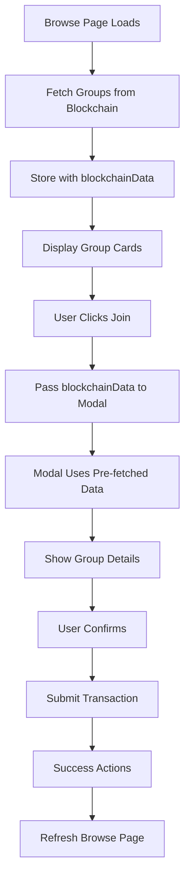

# Browse to Join Flow - Complete Analysis

## 1. Browse Chamas Page (`/browse-chamas`)

### Initial Load
```typescript
// browse-chamas.tsx
const loadGroups = async () => {
  // 1. Get total group count from blockchain
  const totalGroups = await getGroupCount();
  
  // 2. Iterate through group IDs (max 50 for performance)
  for (let i = 0; i < maxGroupsToLoad; i++) {
    const groupInfo = await getGroupInfo(i);
    
    // 3. Convert blockchain data to UI format
    fetchedGroups.push({
      id: i.toString(),
      contributionAmount: parseFloat(groupInfo.contribution) / 1e18,
      roundLength: Math.floor(groupInfo.roundLength / 86400),
      maxMembers: groupInfo.maxMembers,
      currentMembers: groupInfo.memberCount,
      status: determineStatus(groupInfo),
      blockchainData: groupInfo // ✅ Store original blockchain data
    });
  }
  
  // 4. Check membership status for all groups
  await checkMembershipStatus(fetchedGroups);
}
```

### Group Display
- Shows cards with group information
- Displays contribution amount in cBTC
- Shows member count (current/max)
- Status badges (open/active/full/completed)
- Action buttons based on membership status

### User Actions
```typescript
const getButtonConfig = (chama) => {
  if (!isConnected) return { text: 'Connect Wallet', action: 'connect' };
  if (status?.isCreator) return { text: 'Manage', action: 'manage' };
  if (status?.isMember) return { text: 'View Details', action: 'view' };
  if (chama.status === 'full') return { text: 'Full', disabled: true };
  if (balance < chama.contributionAmount) return { text: 'Insufficient Balance', disabled: true };
  return { text: 'Join', action: 'join' };
};
```

## 2. Join Button Click

### Handler Function
```typescript
const handleJoinGroup = async (groupId: string, groupName: string) => {
  // 1. Check wallet connection
  if (!primaryWallet?.address) {
    toast.error('Wallet Required', 'Please connect your wallet');
    return;
  }
  
  // 2. Find group data from loaded groups
  const group = groups.find(g => g.id === groupId);
  
  // 3. Open modal with pre-fetched data
  setSelectedGroupId(parseInt(groupId));
  setSelectedGroupData(group?.blockchainData || null); // ✅ Pass blockchain data
  setShowJoinModal(true);
};
```

## 3. Join Chama Modal Opens

### Step 1: Details Display
```typescript
useEffect(() => {
  if (open && groupId) {
    if (initialGroupData) {
      // ✅ Use pre-fetched data (no blockchain call needed)
      setGroupInfo({
        id: groupId,
        contribution: (initialGroupData.contribution / 1e18).toFixed(6),
        roundLength: Number(initialGroupData.roundLength),
        maxMembers: Number(initialGroupData.maxMembers),
        memberCount: Number(initialGroupData.memberCount),
        isActive: Boolean(initialGroupData.isActive),
        isClosed: !Boolean(initialGroupData.isActive)
      });
    } else if (isConnected) {
      // Fallback: fetch if no initial data
      const info = await getGroupInfo(parseInt(groupId));
    }
  }
}, [open, groupId, initialGroupData]);
```

### Validation Checks
```typescript
// 1. Balance Check
const hasEnoughBalance = contributionNum <= maxSpendableNum;

// 2. Joinability Check
const isJoinable = !groupInfo.isClosed && 
                   groupInfo.memberCount < groupInfo.maxMembers;

// 3. Button State
disabled={!isConnected || !hasEnoughBalance || !isJoinable}
```

### Step 2: Preview Confirmation
- Display participation summary
- Show expected payout calculation
- Display commitment requirements
- Highlight security deposit info

### Step 3: Transaction Submission
```typescript
const handleTransactionSubmit = async () => {
  // 1. Convert string ID to number
  const numericId = parseInt(groupId);
  
  // 2. Check membership (prevent double-join)
  const isMember = await isGroupMember(numericId);
  if (isMember) {
    showError('Already a member');
    return;
  }
  
  // 3. Show pending toast
  const pendingToast = transactionPending("group join");
  
  // 4. Submit blockchain transaction
  const hash = await joinGroup(numericId);
  
  // 5. Success actions
  memberJoined(groupInfo.name, groupInfo.contribution, hash);
  await logActivity('group_joined', ...);
  await awardAchievement('first-group', ...);
  await createNotification(...);
  
  // 6. Trigger parent callback
  onGroupJoined?.();
  
  // 7. Close modal after delay
  setTimeout(() => resetModal(), 2000);
};
```

## 4. Post-Join Actions

### Browse Page Updates
```typescript
const handleJoinSuccess = async () => {
  // Refresh groups to update member count
  await loadGroups();
};
```

### useRosca Hook - joinGroup
```typescript
const joinGroup = async (groupId: number) => {
  // 1. Get group details for contribution amount
  const groupDetails = await publicClient.readContract({
    functionName: "getGroupDetails",
    args: [BigInt(groupId)]
  });
  
  // 2. Check if group is active
  if (!groupDetails.isActive) {
    throw new Error('Group is closed to new members');
  }
  
  // 3. Send join transaction with contribution
  const hash = await walletClient.writeContract({
    functionName: "joinGroup",
    args: [BigInt(groupId)],
    value: groupDetails.contribution // ETH value
  });
  
  // 4. Wait for confirmation
  await publicClient.waitForTransactionReceipt({ hash });
  
  // 5. Refresh balance
  await getBalance();
  
  return hash;
};
```

## Data Flow Summary



## Key Optimizations

1. **Pre-fetching**: Groups are loaded once on browse page
2. **Data Reuse**: Blockchain data passed to modal (no re-fetch)
3. **Type Safety**: Proper conversions (BigInt, Number, Boolean)
4. **Error Handling**: Multiple validation points
5. **User Feedback**: Toasts, loading states, success messages

## Potential Issues & Solutions

### Issue 1: Large Group Count
- **Problem**: Loading 1000+ groups would be slow
- **Solution**: Pagination or infinite scroll

### Issue 2: Stale Data
- **Problem**: Group data might change between browse and join
- **Current**: Manual refresh button
- **Better**: Auto-refresh on focus or periodic updates

### Issue 3: Race Conditions
- **Problem**: Multiple users joining simultaneously
- **Solution**: Contract handles this, UI shows appropriate errors

### Issue 4: Network Delays
- **Problem**: Slow RPC responses
- **Solution**: Loading states, timeout handling, retry logic

## Success Metrics

✅ **Performance**
- Single blockchain fetch per group
- Pre-fetched data reuse
- Efficient member status checking

✅ **User Experience**
- Clear status indicators
- Proper error messages
- Loading states
- Success feedback

✅ **Data Integrity**
- Type-safe conversions
- Validation at multiple levels
- Membership verification

✅ **Error Recovery**
- Graceful error handling
- User-friendly messages
- Modal state reset on error
