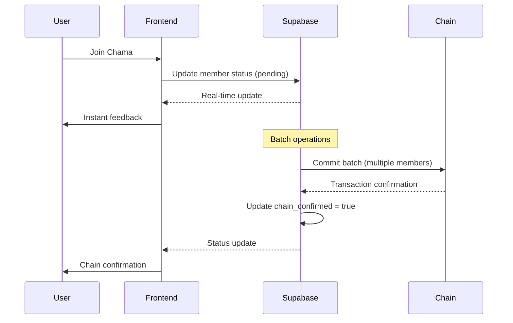

# Off-Chain Chama Management Plan

## Executive Summary

This document outlines a comprehensive plan to move chama management to off-chain storage using Supabase, addressing the current reactive UI issues while maintaining blockchain security for final transactions. The hybrid approach will provide instant UI updates, faster joining processes, and reduced gas costs while preserving the trustless nature of the core financial operations.

## Current Issues Analysis

### Identified Problems

1. **Reactive UI Inconsistencies**:
   - Buttons show incorrect states (e.g., "round has ended" when user couldn't contribute)
   - Slow blockchain queries cause UI lag
   - Cache invalidation issues with TanStack Query
   - Race conditions between different data sources

2. **Poor UX for Member Actions**:
   - Joining requires immediate gas payment
   - No preview or confirmation before committing
   - Slow feedback for member readiness
   - Complex member status tracking

3. **Gas Costs**:
   - Every interaction requires gas
   - Failed transactions waste gas
   - Multiple small transactions instead of batched operations

### Root Causes

- **Blockchain-First Architecture**: All state managed on-chain
- **Complex State Dependencies**: Multiple contracts calls for single UI update
- **No Intermediate States**: Binary on-chain/off-chain states
- **Limited Query Optimization**: Direct contract calls without caching layer

## Solution Architecture

### Hybrid On-Chain/Off-Chain Model

```
┌─────────────────┐    ┌─────────────────┐    ┌─────────────────┐
│                 │    │                 │    │                 │
│   Frontend      │◄──►│   Supabase      │◄──►│   Smart         │
│   (React)       │    │   (Off-chain)   │    │   Contracts     │
│                 │    │                 │    │                 │
└─────────────────┘    └─────────────────┘    └─────────────────┘
        │                        │                        │
        │                        │                        │
        ▼                        ▼                        ▼
    Instant UI             State Management        Final Settlement
    Real-time sync         Batch Operations        Trustless Security
    Rich UX                Conflict Resolution     Immutable Records
```

## Database Schema Design

### Core Tables

```sql
-- Chama management table
CREATE TABLE chamas (
    id UUID PRIMARY KEY DEFAULT gen_random_uuid(),
    chain_address TEXT UNIQUE, -- NULL until deployed to chain
    name TEXT NOT NULL,
    description TEXT,
    creator_address TEXT NOT NULL,
    
    -- Chama configuration
    contribution_amount DECIMAL(20, 8) NOT NULL,
    security_deposit DECIMAL(20, 8) NOT NULL,
    member_target INTEGER NOT NULL,
    round_duration_hours INTEGER NOT NULL,
    
    -- Status tracking
    status TEXT NOT NULL DEFAULT 'draft', -- draft, recruiting, waiting, active, completed, cancelled
    chain_status INTEGER, -- Maps to smart contract status
    
    -- Timing
    created_at TIMESTAMP WITH TIME ZONE DEFAULT NOW(),
    recruitment_deadline TIMESTAMP WITH TIME ZONE,
    chain_deployed_at TIMESTAMP WITH TIME ZONE,
    started_at TIMESTAMP WITH TIME ZONE,
    completed_at TIMESTAMP WITH TIME ZONE,
    
    -- Metadata
    is_private BOOLEAN DEFAULT FALSE,
    invitation_code TEXT UNIQUE,
    chain_tx_hash TEXT, -- Transaction hash when deployed to chain
    
    -- Indexes
    INDEX idx_chamas_creator (creator_address),
    INDEX idx_chamas_status (status),
    INDEX idx_chamas_chain_address (chain_address)
);

-- Member management table
CREATE TABLE chama_members (
    id UUID PRIMARY KEY DEFAULT gen_random_uuid(),
    chama_id UUID NOT NULL REFERENCES chamas(id) ON DELETE CASCADE,
    user_address TEXT NOT NULL,
    
    -- Member status
    status TEXT NOT NULL DEFAULT 'invited', -- invited, pending, confirmed, active, defaulted, completed
    join_method TEXT NOT NULL, -- invited, direct_join, creator
    
    -- Financial tracking
    deposit_status TEXT NOT NULL DEFAULT 'pending', -- pending, paid, confirmed, forfeited
    deposit_amount DECIMAL(20, 8),
    deposit_tx_hash TEXT,
    
    -- Participation
    agreed_to_terms BOOLEAN DEFAULT FALSE,
    agreed_at TIMESTAMP WITH TIME ZONE,
    
    -- Chain sync
    chain_confirmed BOOLEAN DEFAULT FALSE,
    chain_sync_at TIMESTAMP WITH TIME ZONE,
    
    -- Timing
    invited_at TIMESTAMP WITH TIME ZONE DEFAULT NOW(),
    joined_at TIMESTAMP WITH TIME ZONE,
    
    -- Constraints
    UNIQUE(chama_id, user_address),
    INDEX idx_members_chama (chama_id),
    INDEX idx_members_user (user_address),
    INDEX idx_members_status (status)
);

-- Round management table
CREATE TABLE chama_rounds (
    id UUID PRIMARY KEY DEFAULT gen_random_uuid(),
    chama_id UUID NOT NULL REFERENCES chamas(id) ON DELETE CASCADE,
    round_number INTEGER NOT NULL,
    
    -- Round configuration
    winner_address TEXT,
    winner_selection_method TEXT, -- lottery, rotation, bidding
    payout_amount DECIMAL(20, 8),
    
    -- Timing
    start_time TIMESTAMP WITH TIME ZONE NOT NULL,
    end_time TIMESTAMP WITH TIME ZONE NOT NULL,
    actual_end_time TIMESTAMP WITH TIME ZONE,
    
    -- Status
    status TEXT NOT NULL DEFAULT 'pending', -- pending, active, completed, expired
    chain_confirmed BOOLEAN DEFAULT FALSE,
    chain_tx_hash TEXT,
    
    -- Participation tracking
    expected_contributions INTEGER NOT NULL,
    received_contributions INTEGER DEFAULT 0,
    total_pot DECIMAL(20, 8) DEFAULT 0,
    
    -- Constraints
    UNIQUE(chama_id, round_number),
    INDEX idx_rounds_chama (chama_id),
    INDEX idx_rounds_status (status),
    INDEX idx_rounds_timing (start_time, end_time)
);

-- Contribution tracking table
CREATE TABLE contributions (
    id UUID PRIMARY KEY DEFAULT gen_random_uuid(),
    chama_id UUID NOT NULL REFERENCES chamas(id) ON DELETE CASCADE,
    round_id UUID NOT NULL REFERENCES chama_rounds(id) ON DELETE CASCADE,
    member_id UUID NOT NULL REFERENCES chama_members(id) ON DELETE CASCADE,
    
    -- Contribution details
    amount DECIMAL(20, 8) NOT NULL,
    contributed_at TIMESTAMP WITH TIME ZONE DEFAULT NOW(),
    
    -- Status tracking
    status TEXT NOT NULL DEFAULT 'pending', -- pending, confirmed, failed, refunded
    is_late BOOLEAN DEFAULT FALSE,
    late_penalty DECIMAL(20, 8) DEFAULT 0,
    
    -- Chain sync
    chain_tx_hash TEXT,
    chain_confirmed BOOLEAN DEFAULT FALSE,
    chain_sync_at TIMESTAMP WITH TIME ZONE,
    
    -- Metadata
    contribution_method TEXT, -- wallet, auto_deduct
    notes TEXT,
    
    -- Constraints
    UNIQUE(round_id, member_id),
    INDEX idx_contributions_chama (chama_id),
    INDEX idx_contributions_round (round_id),
    INDEX idx_contributions_member (member_id),
    INDEX idx_contributions_status (status)
);

-- Invitation and notification system
CREATE TABLE invitations (
    id UUID PRIMARY KEY DEFAULT gen_random_uuid(),
    chama_id UUID NOT NULL REFERENCES chamas(id) ON DELETE CASCADE,
    inviter_address TEXT NOT NULL,
    invitee_address TEXT,
    invitee_email TEXT,
    
    -- Invitation details
    invitation_code TEXT UNIQUE NOT NULL,
    message TEXT,
    expires_at TIMESTAMP WITH TIME ZONE NOT NULL,
    
    -- Status
    status TEXT NOT NULL DEFAULT 'sent', -- sent, viewed, accepted, rejected, expired
    responded_at TIMESTAMP WITH TIME ZONE,
    
    -- Timing
    created_at TIMESTAMP WITH TIME ZONE DEFAULT NOW(),
    
    -- Constraints
    INDEX idx_invitations_chama (chama_id),
    INDEX idx_invitations_code (invitation_code),
    INDEX idx_invitations_invitee (invitee_address)
);

-- Event log for audit trail
CREATE TABLE chama_events (
    id UUID PRIMARY KEY DEFAULT gen_random_uuid(),
    chama_id UUID NOT NULL REFERENCES chamas(id) ON DELETE CASCADE,
    event_type TEXT NOT NULL,
    actor_address TEXT NOT NULL,
    
    -- Event data
    event_data JSONB NOT NULL,
    created_at TIMESTAMP WITH TIME ZONE DEFAULT NOW(),
    
    -- Chain reference
    chain_tx_hash TEXT,
    block_number BIGINT,
    
    -- Indexes
    INDEX idx_events_chama (chama_id),
    INDEX idx_events_type (event_type),
    INDEX idx_events_actor (actor_address),
    INDEX idx_events_created (created_at)
);

-- Batch operations for chain synchronization
CREATE TABLE batch_operations (
    id UUID PRIMARY KEY DEFAULT gen_random_uuid(),
    operation_type TEXT NOT NULL, -- deploy_chama, batch_join, batch_contribute, start_rosca
    chama_id UUID NOT NULL REFERENCES chamas(id) ON DELETE CASCADE,
    
    -- Operation data
    operation_data JSONB NOT NULL, -- Contains all the data needed for the batch operation
    estimated_gas BIGINT,
    
    -- Status tracking
    status TEXT NOT NULL DEFAULT 'pending', -- pending, executing, completed, failed, cancelled
    error_message TEXT,
    retry_count INTEGER DEFAULT 0,
    max_retries INTEGER DEFAULT 3,
    
    -- Chain details
    tx_hash TEXT,
    block_number BIGINT,
    gas_used BIGINT,
    
    -- Timing
    created_at TIMESTAMP WITH TIME ZONE DEFAULT NOW(),
    scheduled_for TIMESTAMP WITH TIME ZONE,
    executed_at TIMESTAMP WITH TIME ZONE,
    completed_at TIMESTAMP WITH TIME ZONE,
    
    -- Indexes
    INDEX idx_batch_ops_chama (chama_id),
    INDEX idx_batch_ops_status (status),
    INDEX idx_batch_ops_type (operation_type),
    INDEX idx_batch_ops_scheduled (scheduled_for)
);
```

## Smart Contract Modifications

### Current vs. Proposed Architecture

#### Current (Everything On-Chain)
```solidity
// Every action requires immediate gas payment
function joinROSCA() external payable {
    // Immediate state change
    members[msg.sender].isActive = true;
    // Immediate deposit requirement
    require(msg.value == getRequiredDeposit(), "Incorrect deposit");
    // Cannot undo or preview
}
```

#### Proposed (Batch Operations)
```solidity
// Batch joining - multiple members at once
function batchJoinROSCA(
    address[] calldata members,
    uint256[] calldata deposits
) external payable onlyCreatorOrOperator {
    require(members.length == deposits.length, "Array length mismatch");
    
    uint256 totalRequired = 0;
    for (uint256 i = 0; i < deposits.length; i++) {
        totalRequired += deposits[i];
    }
    require(msg.value == totalRequired, "Incorrect total deposit");
    
    for (uint256 i = 0; i < members.length; i++) {
        _addMember(members[i], deposits[i]);
    }
}

// Commit off-chain state to chain
function commitChamaState(
    ChamaState calldata state,
    bytes32 merkleRoot,
    bytes32[] calldata proofs
) external onlyAuthorized {
    require(_verifyState(state, merkleRoot, proofs), "Invalid state proof");
    _updateChainState(state);
}
```

### New Contract Functions

```solidity
// Operator management for off-chain system
mapping(address => bool) public authorizedOperators;

function setOperator(address operator, bool authorized) external onlyOwner {
    authorizedOperators[operator] = authorized;
}

// Batch operations
struct BatchJoinData {
    address[] members;
    uint256[] deposits;
    bytes32 stateHash;
}

struct BatchContributeData {
    address[] contributors;
    uint256[] amounts;
    uint256 roundNumber;
    bytes32 stateHash;
}

// Emergency functions
function emergencyPause() external onlyOwner {
    _pause();
}

function emergencyRecoverFunds() external onlyOwner {
    // Only callable if contract is paused and timelock expired
}
```

## Integration Architecture

### API Layer Design

```typescript
// Off-chain chama service
interface ChamaService {
  // Chama management
  createChama(data: CreateChamaData): Promise<ChamaResponse>;
  joinChama(chamaId: string, userAddress: string): Promise<JoinResponse>;
  inviteMembers(chamaId: string, invitations: InvitationData[]): Promise<void>;
  
  // State management
  getChamaState(chamaId: string): Promise<ChamaState>;
  updateMemberStatus(memberId: string, status: MemberStatus): Promise<void>;
  recordContribution(contributionData: ContributionData): Promise<void>;
  
  // Chain synchronization
  scheduleChainDeployment(chamaId: string): Promise<BatchOperation>;
  commitToChain(operationId: string): Promise<TransactionHash>;
  syncFromChain(chamaAddress: string): Promise<void>;
}

// Real-time subscription service
interface RealtimeService {
  subscribeToChamaUpdates(chamaId: string, callback: ChamaUpdateCallback): void;
  subscribeToMemberUpdates(memberId: string, callback: MemberUpdateCallback): void;
  subscribeToRoundUpdates(roundId: string, callback: RoundUpdateCallback): void;
}
```

### State Synchronization



## Implementation Strategy

### Phase 1: Foundation (Weeks 1-2)
1. **Database Setup**
   - Deploy Supabase instance
   - Create tables and indexes
   - Set up Row Level Security (RLS)
   - Configure real-time subscriptions

2. **API Development**
   - Create Supabase Edge Functions
   - Implement CRUD operations
   - Add validation and error handling
   - Set up authentication integration

### Phase 2: Core Features (Weeks 3-4)
1. **Chama Creation & Management**
   - Off-chain chama creation
   - Member invitation system
   - Real-time member status updates
   - Preview and confirmation flows

2. **Smart Contract Updates**
   - Add batch operation functions
   - Implement operator system
   - Add emergency controls
   - Deploy to testnet

### Phase 3: Integration (Weeks 5-6)
1. **Frontend Refactoring**
   - Replace blockchain-direct queries
   - Implement real-time subscriptions
   - Add optimistic UI updates
   - Improved error handling

2. **Chain Synchronization**
   - Batch operation scheduler
   - State commitment system
   - Conflict resolution
   - Recovery mechanisms

### Phase 4: Testing & Deployment (Weeks 7-8)
1. **Testing**
   - Unit tests for all components
   - Integration testing
   - Load testing
   - Security audits

2. **Migration**
   - Gradual rollout strategy
   - Data migration tools
   - Rollback procedures
   - Monitoring and alerts

## Data Flow Examples

### Creating a Chama

```typescript
// 1. Off-chain creation (instant)
const chama = await chamaService.createChama({
  name: "Savings Circle 2024",
  contributionAmount: "0.01",
  memberTarget: 10,
  roundDurationHours: 168, // 1 week
});

// 2. Invite members (no gas required)
await chamaService.inviteMembers(chama.id, [
  { address: "0x123...", email: "member1@example.com" },
  { address: "0x456...", email: "member2@example.com" },
]);

// 3. Members join (instant confirmation)
await chamaService.joinChama(chama.id, userAddress);

// 4. Batch deployment when ready
const batchOp = await chamaService.scheduleChainDeployment(chama.id);
await chamaService.commitToChain(batchOp.id);
```

### Contributing to a Round

```typescript
// 1. Check round status (real-time)
const round = await chamaService.getCurrentRound(chamaId);

// 2. Record contribution intent (instant)
const contribution = await chamaService.recordContribution({
  chamaId,
  roundId: round.id,
  amount: round.contributionAmount,
});

// 3. UI updates immediately
setContributionStatus("pending_chain");

// 4. Batch commit to chain
const batchOp = await chamaService.scheduleBatchContribute(roundId);
// Chain confirmation happens asynchronously
```

## Benefits of This Approach

### User Experience
- **Instant Feedback**: All actions provide immediate UI updates
- **Preview Mode**: Users can see effects before committing to chain
- **Reduced Friction**: No gas required for exploration and planning
- **Rich Notifications**: Real-time updates and progress tracking

### Gas Optimization
- **Batch Operations**: Multiple actions in single transaction
- **Reduced Failed Transactions**: Validation happens off-chain
- **Optional Chain Commitment**: Only finalize when ready

### Developer Experience
- **Simplified State Management**: Single source of truth in Supabase
- **Real-time Sync**: Automatic UI updates via subscriptions
- **Better Error Handling**: Graceful degradation and recovery
- **Rich Analytics**: Detailed tracking and reporting

### Scalability
- **Database Performance**: Optimized queries and indexes
- **Chain Efficiency**: Reduced on-chain operations
- **Horizontal Scaling**: Supabase handles scaling automatically

## Security Considerations

### Trust Model
- **Off-chain State**: Temporary, user convenience layer
- **Chain State**: Final, immutable source of truth
- **Operator System**: Multi-sig controlled, time-locked operations
- **Emergency Controls**: Pause and recovery mechanisms

### Attack Vectors & Mitigations
1. **Database Compromise**: RLS, encryption, audit logs
2. **Operator Compromise**: Multi-sig, time delays, monitoring
3. **State Inconsistency**: Merkle proofs, automatic reconciliation
4. **Front-running**: Commit-reveal schemes, batch ordering

### Compliance
- **Data Privacy**: GDPR compliant, user data controls
- **Financial Records**: Immutable audit trail
- **Regulatory**: Configurable compliance rules

## Migration Strategy

### Existing Chamas
1. **Snapshot Current State**: Export all on-chain data
2. **Populate Off-chain DB**: Import with chain_confirmed = true
3. **Gradual Migration**: New features available progressively
4. **Dual Mode**: Support both old and new systems temporarily

### User Communication
1. **Feature Announcements**: Progressive disclosure of new capabilities
2. **Migration Benefits**: Explain improvements and cost savings
3. **Opt-in Approach**: Users choose when to use new features
4. **Support**: Help documentation and user assistance

This hybrid approach maintains the security and trustlessness of blockchain while providing the responsiveness and user experience of modern web applications. The key is proper state synchronization and clear separation of concerns between off-chain convenience and on-chain finality.
